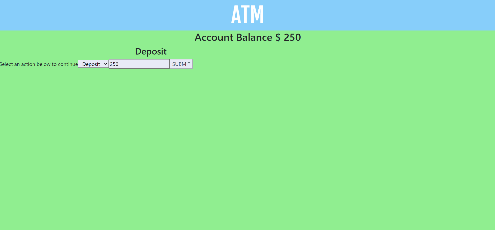

# ATM UI Assignment

## Description of Project
In this exercise, an ATM user interface needed to be created to mimic a true ATM machine. The functionality of the code allows you to deposit a specified amount with the "Deposit" option or allows you to withdraw a specified amount using the "Cash Back" option. Additionally, code was written to make sure the user cannot withdraw over the amount that is within their account. The transaction will not process. How to Run: In order to run this file, download all the files to a singular location. Open a tab in the browser window and drag the index.html file. You can begin to interact with the code when you make a selection of depositing money. Notice that the amount will update when you input a variety of numbers. Roadmap: I hope to revisit this project to adjust and make the UI styles better looking. Aligning all the text and input boxes so that they are in one area and then also fixing the background colors.

## License Information
LICENSE: MIT License

Copyright (c) 2020 John Williams

Permission is hereby granted, free of charge, to any person obtaining a copy
of this software and associated documentation files (the "Software"), to deal
in the Software without restriction, including without limitation the rights
to use, copy, modify, merge, publish, distribute, sublicense, and/or sell
copies of the Software, and to permit persons to whom the Software is
furnished to do so, subject to the following conditions:

The above copyright notice and this permission notice shall be included in all
copies or substantial portions of the Software.

THE SOFTWARE IS PROVIDED "AS IS", WITHOUT WARRANTY OF ANY KIND, EXPRESS OR
IMPLIED, INCLUDING BUT NOT LIMITED TO THE WARRANTIES OF MERCHANTABILITY,
FITNESS FOR A PARTICULAR PURPOSE AND NONINFRINGEMENT. IN NO EVENT SHALL THE
AUTHORS OR COPYRIGHT HOLDERS BE LIABLE FOR ANY CLAIM, DAMAGES OR OTHER
LIABILITY, WHETHER IN AN ACTION OF CONTRACT, TORT OR OTHERWISE, ARISING FROM,
OUT OF OR IN CONNECTION WITH THE SOFTWARE OR THE USE OR OTHER DEALINGS IN THE
SOFTWARE.
